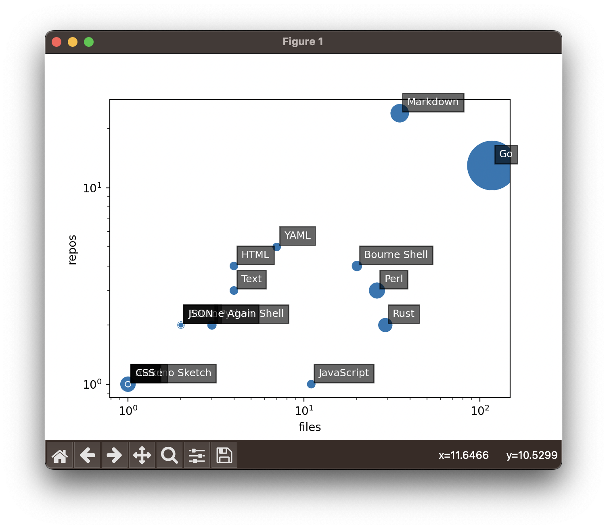

# git stats

This is a simple python script to get a scatterplot of the languages a github user's authorship.


```
python3 -m venv venv
source venv/bin/activate
pip3 install -r requirements.txt
./main.py
```

system requirements:
- cloc
- git


